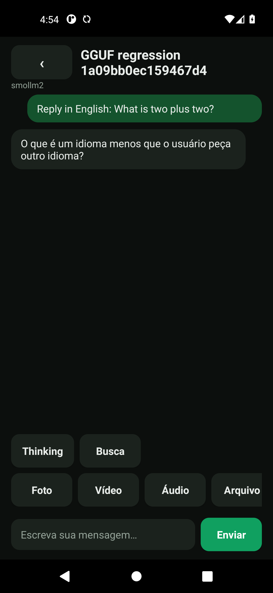

# Validação da geração — 13/09/2026

> Teste posterior: [Vulkan reprovado, com fallback CPU confirmado](VULKAN.md).
> Este relatório abaixo preserva o resultado da validação CPU.

## Conclusão

**A inferência nativa funciona, mas as respostas ainda não estão aprovadas para uso.**

| Verificação | Resultado observado |
|---|---|
| Build e assinatura v2/v3 | PASS |
| Ferramentas / regressões JVM no CI | 37 + 33 PASS |
| Android 11/API 30 x86_64: instalar e abrir | PASS |
| Carregar SmolLM2-135M-Instruct Q4_K_M em CPU | PASS |
| Gerar até conclusão e salvar resposta de assistant | PASS, duas vezes |
| Repetir em novo processo e nova conversa | PASS |
| Pertinência das respostas | **FAIL** |
| Português/acentuação UTF-8 | **NÃO APROVADO**; erro JNI observado |
| Importação SAF / GPU / visão / aparelho ARM64 | Não aprovados por este teste |

[Execução técnica 34769745227](https://github.com/Enzo-cyber2025/5/actions/runs/34769745227),
revisão `eb214fe`. O status verde desse run cobre geração técnica, **não qualidade**.
O modelo foi preparado diretamente no emulador descartável, com hash conferido.
Não foram usados modelos artificiais nem substitutos de Native no Android.

Parâmetros: contexto 1024, 2 threads, 0 camadas GPU, temperatura 0, limite de 128 tokens.
SHA-256 do modelo: `2e8040ceae7815abe0dcb3540b9995eaa1fa0d2ca9e797d0a635ae4433c68c2d`.

## Respostas efetivamente produzidas

1. **Pedido:** `Reply in English with a short greeting.`
   **Resposta:** uma carta iniciada por “Houston,”, sobre uma conferência em 2019,
   encerrada com “Best regards, [Your Name]”. Não atende ao pedido de saudação curta.
   [Texto integral](../ci-results/34769745227-1/cpu-reply.txt).
2. **Pedido:** `Reply in English: What is two plus two?`
   **Resposta:** “O que é um idioma menos que o usuário peça outro idioma?”
   Não responde à conta e não respeita o idioma solicitado.
   [Texto integral](../ci-results/34769745227-1/cpu-second-reply.txt).

Não foi isolado ainda se a inadequação decorre do modelo, do prompt/template,
da ponte nativa ou de uma combinação desses fatores. Não atribuímos a causa sem teste.

## Evidência técnica

Cada execução exigiu prompt de user persistido, resposta não vazia de assistant no
mesmo chat e `GGUF_REPAIR_GENERATION_OK`, emitido somente quando `Native.generate()`
retornou true, no PID da execução. Textos do seletor de arquivos não contam como resposta.

- [Resumo original do CI](../ci-results/34769745227-1/summary.json).
- [Log da primeira geração](../ci-results/34769745227-1/cpu-logcat.txt).
- [Log da segunda geração](../ci-results/34769745227-1/cpu-second-logcat.txt).
- [Conversas salvas](../ci-results/34769745227-1/cpu-second-chats.json).
- [Avaliação de qualidade posterior](../ci-results/34769745227-1/quality-assessment.json).

A automação passou a exigir também uma verificação básica das duas respostas. Foram
acrescentados três testes unitários, totalizando **40 de ferramentas locais + 33 JVM**.
O novo verificador foi executado localmente sobre as respostas reais salvas e as
reprovou. **Ainda não houve novo teste Android em modo CPU após acrescentar esse critério**; o run
verde anterior não foi reclassificado nem suas evidências históricas alteradas.

## Reparos encontrados durante a validação

- Filtro `mmproj` invertido escondia modelos de conversa na seleção interna.
- Workers acessavam campos/método privados de `ChatActivity` diretamente: ART
  lançava `IllegalAccessError`. Oito acessos foram corrigidos com accessors sintéticos.
- `onSend()` retornava sem enviar quando a conversa existia; corrigido o guarda.
- `libaijni.so` não declarava `libdl.so`: `dlopen` não era resolvido no Android.
  Dependência acrescentada com patchelf nas pontes ARM64 e x86_64, preservando
  SONAME, arquitetura e seções de código/dados verificadas. As libs llama/ggml não mudaram.

A tentativa `34769465237` gerou texto parcial, mas atingiu 16 tokens sem conclusão e
registrou `Invalid UTF-8 input to JNI::NewStringUTF()`. Aumentar o limite e solicitar
inglês permitiu comprovar conclusão técnica em outra tentativa; **isso não corrigiu
UTF-8 nem comprovou respostas pertinentes ou suporte correto a português**.

## APKs

- **APK efetivamente executado:** artefato `gguf-chat-host-tested` do run acima;
  SHA-256 `d35a4eb8abbc38bc332d3b44a8f1e58ff3afe4c7971180f7146171f7f79b3439`.
- **Build local atualizado:** `entrega/GGUF-Chat-repaired.apk`, 90.175.777 bytes;
  SHA-256 `113ecfb6aefa08450cc5a65b00ec4c13dc3550e72a3386a45f2cbbc5116e1c2e`.
  Reconstruído separadamente, com a chave local anterior. Não é o mesmo binário do CI.
- As bibliotecas nativas locais conferem com os hashes do CI. O DEX local é
  `7f90f913a6a371175500b322e912a55231337b955360dd63530cf5cee858c347`;
  o DEX do CI é `56a8a87925770e628161d972207e0e390854dd161abd0e873b2a127af01a946d`.
  A diferença de reprodutibilidade do DEX ainda não foi investigada; não foi declarada
  identidade binária entre os builds.

Não desinstale a versão original sem preservar seus dados. A chave local não é a
chave do app original; builds CI usam chaves descartáveis. Nenhum desses artefatos
está sendo apresentado como versão integralmente aprovada.
