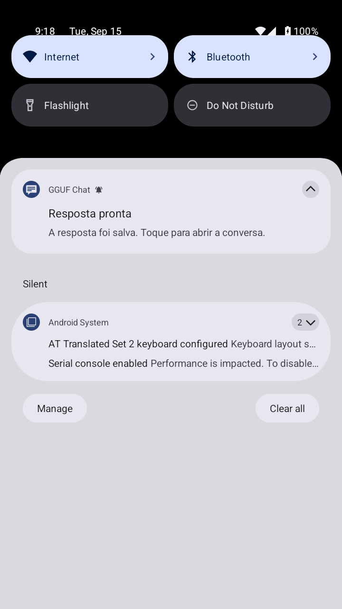
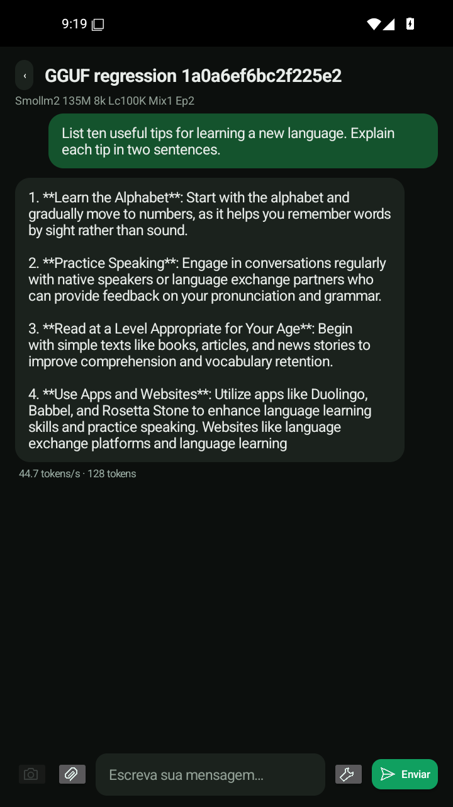

# Resposta pronta com a tela apagada

## Alterações

- Canal separado **Respostas prontas**, com importância padrão. O antigo canal de progresso continua discreto.
- Avisa **somente depois de salvar uma resposta bem-sucedida**, quando a tela está apagada ou bloqueada. Cancelamento, erro e resposta não salva não recebem aviso de sucesso.
- Texto genérico, sem expor o conteúdo da conversa: “A resposta foi salva. Toque para abrir a conversa.” O toque abre a conversa correta e remove seu aviso.
- A notificação final permanece após encerrar o serviço de geração. A proteção de CPU fica mantida até entregar o aviso ao Android; a limpeza final libera os recursos, sem parar uma geração mais nova.
- Atualizações da notificação de progresso são suprimidas com a tela apagada/bloqueada, evitando formatação e chamadas desnecessárias ao sistema. Isso **não suprime tokens**, processamento nativo ou gravação da resposta.
- Evitada uma cópia redundante da resposta completa. Motor, caches, pesos, quantização, batching e recursos do APK anterior não foram alterados.

## Identidade e atualização

APK SHA-256: `3baa171c78eb5ee7f6f5c3c212904f53547a13184b9c01ea1d6ec565e2f5152e`.

28.370.381 bytes; Android 9+, ARM64/x86_64; modelos não incluídos.

Fonte: `b2354d2182f45954075a6317e92a0b0c33a5f4da`.
Build: [35023976441](https://github.com/Enzo-cyber2025/5/actions/runs/35023976441), job `104566396167`.
Motor nativo preservado: `ce0118db8646f1523d11725a8c5c29b6e88230f2`.
Certificado: `4f75afe8637f28ccb167db407e3b2bc9b260e1cfe6059b7377ea20b0b4dc2ac3`.

Mesma assinatura do último APK entregue, `eabd0169…`: não é necessário desinstalá-lo. Isso **não** estabelece compatibilidade com versões antigas assinadas com `3dd…` ou `9b…`.

## Limites

Android 13+ precisa da permissão de notificações. Configurações do canal, do aplicativo e Não Perturbe são respeitadas; não há tentativa de contorná-las. Sem permissão, a resposta continua sendo salva, mas não há aviso na cortina.

Testes em emulador não garantem som audível em alto-falante físico, comportamento de todos os fabricantes, sobrevivência a “Forçar parada” ou desempenho de GPU física. Nenhum novo percentual de aceleração da inferência é alegado: esta rodada reduz trabalho auxiliar em segundo plano. Os ganhos medidos anteriormente do cache continuam documentados em [RESPONSE_LATENCY.md](RESPONSE_LATENCY.md), referentes à versão e ao ensaio anteriores.

## Testes reais do APK final — 8/8 aprovados

[Execução 35024391643](https://github.com/Enzo-cyber2025/5/actions/runs/35024391643), job `104567769488`, Android 35 x86_64, CPU; APK exato assinado acima. [Aprovação verificável](../.delivery/reply-notification-acceptance.json).

1. Atualização sobre o APK entregue anteriormente preservou modelos, conversas e arquivo privado de teste.
2. Texto completo de 128 tokens idêntico antes/depois; término efetivamente após o sistema entrar em sono, resposta salva e aviso persistente após serviço encerrado e proteção de CPU liberada.
3. Zero atualizações da notificação de progresso durante o trecho medido com tela apagada; 45 verificações de callback dispensadas por esse estado. **Não significa 45 notificações anteriormente publicadas nem tokens descartados.**
4. Toque real na cortina, partindo de outra conversa, abriu a conversa certa e removeu seu aviso.
5. Continuação com tela ativa não gerou alerta desnecessário e reutilizou o cache nativo do histórico.
6. Cancelamento real não emitiu notificação de sucesso.
7. Inferência com pixels reais do cachorro, modelo visual unificado, resposta “Dog.”; término com tela apagada, aviso presente no NotificationManager e serviço encerrado.
8. Permissão POST_NOTIFICATIONS realmente revogada: geração salva normalmente, sem aviso indevido.

Regressões locais: **22 passaram, 1 pulado** (compilador Java não disponível localmente; build Java feito no CI).

### Capturas autênticas revisadas

A captura da etapa visual feita durante o sono está preta; não a apresentamos como prova visual do conteúdo. Sua resposta, processamento de imagem, ordem de sono/conclusão e registro do aviso estão nos arquivos de evidência. Aprovação funcional não certifica a qualidade geral do modelo: no ensaio sem permissão, o modelo pequeno não obedeceu ao pedido de saudação; o teste comprova salvamento e respeito à permissão, não qualidade semântica.
