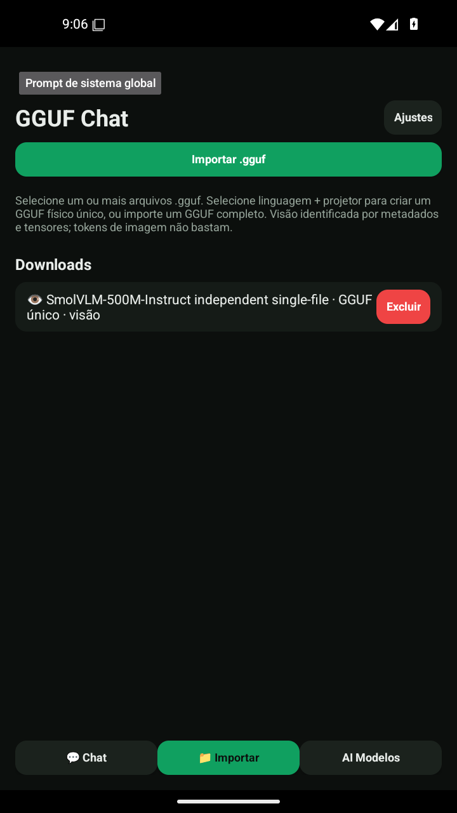
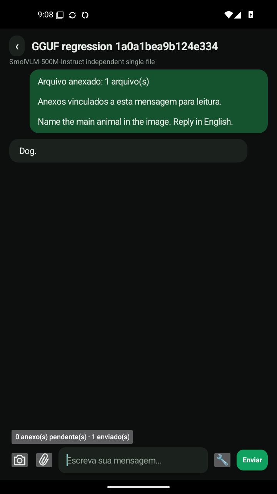

# Teste isolado: SmolVLM-500M multimodal em um único GGUF

**Resultado: PASS no APK assinado já entregue, em Android limpo.** Execução [34896578127](https://github.com/Enzo-cyber2025/5/actions/runs/34896578127), concluída em **8min39s**. Resumo, arquivos persistidos, logs nativos e capturas foram conferidos após a conclusão.

**Origem importante:** este arquivo completo foi preparado **fora do app**, com GGUFWriter upstream e os pesos reais do SmolVLM-500M-Instruct Q8_0. **Não é um download que o autor já distribuía unificado.** A pesquisa não encontrou um arquivo público já completo verificável entre os candidatos examinados. O teste comprova a importação e execução isolada de um GGUF completo; não comprova ter encontrado um modelo público originalmente distribuído dessa maneira.

## O que realmente chegou ao Android

- Somente `model.gguf`, nome neutro, **545.588.736 bytes** (aproximadamente 545,6 MB / 520,3 MiB).
- **489 tensores: 291 de linguagem + 198 de visão/projeção.** Todos comparados por nome, shape, tipo e SHA-256 com os pesos originais antes de iniciar o emulador.
- SHA-256: `23180f3b1854828fcf8e89acd8660045d0841163b08abdd17c216c05e648080c`.
- Nenhum metadado privado `ggufchat.*` necessário para reconhecer visão.
- Os dois arquivos de origem foram excluídos do cache de preparação **antes de iniciar o Android**. Nenhum deles foi copiado para o emulador.
- Instalação do APK, limpeza dos dados somente no emulador descartável, biblioteca inicialmente vazia e importação real pelo seletor de arquivos do Android.
- Nenhuma seleção de par e nenhuma chamada ao unificador de pares do app. O teste exige ausência de `GGUF_PHYSICAL_UNIFICATION_OK` nessa importação.
- Depois da cópia privada byte a byte, a cópia de entrada em Downloads também foi removida. Restou **um único GGUF privado**, sem projetor externo disponível para a inferência.

O registro do modelo foi identificado como `VISION_SINGLE_GGUF`, `multimodal=true` e `path == mmprojPath`. O segundo campo aponta ao **mesmo arquivo**, não a um arquivo mmproj oculto. O inventário físico foi novamente verificado após as gerações e após reiniciar o aplicativo; Downloads continuou sem GGUFs.

## Respostas reais

| Ensaio | Resposta integral, sem o espaço inicial | Resultado |
| --- | --- | --- |
| Foto de um cão, pergunta pelo animal principal | `Dog.` | PASS |
| Foto de um ônibus, pergunta pelo veículo principal | `Bus.` | PASS |
| Reinício do app e nova pergunta sobre a imagem persistida | `Bus.` | PASS |
| Conversa só de texto: quanto é dois mais dois? | `4.` | PASS para a resposta aritmética; houve ponto final além do número solicitado |

As imagens tinham nomes neutros (`frame-a.jpg` e `frame-b.jpg`); as perguntas não forneciam “dog” ou “bus”. Os logs confirmam avaliação dos pixels pelo mtmd, não apenas leitura do nome/contagem de anexos.

Os quatro carregamentos registraram:

```text
load_tensors: offloaded 33/33 layers to GPU
GGUF_SINGLE_FILE_LOADED same_path=1
GGUF_UNIT_LOADED language=Vulkan layers=33 projector=Vulkan
```

**Vulkan por software (Mesa) no emulador**, não GPU física. Offload das camadas não significa que absolutamente toda operação do scheduler execute na GPU. Não houve retry silencioso da unidade inteira em CPU.

## Capturas reais

### Importação de um único modelo completo



### Inferência visual



[Ônibus](../ci-results/34896578127-1/inference-standalone-vehicle.png) · [Após reinício](../ci-results/34896578127-1/inference-standalone-restart.png) · [Texto](../ci-results/34896578127-1/inference-standalone-text.png).

## Proveniência e reprodução

Pesos de origem: [ggml-org/SmolVLM-500M-Instruct-GGUF, revisão fixada](https://huggingface.co/ggml-org/SmolVLM-500M-Instruct-GGUF/tree/72e986006ef53e37cdd3f6d4241c90b0f01df376), licença Apache-2.0. O repositório de origem fornece linguagem e projetor separados; o empacotamento independente deste teste é explícito.

| Origem | Bytes | SHA-256 |
| --- | ---: | --- |
| Linguagem Q8_0 | 436.806.912 | `9d4612de6a42214499e301494a3ecc2be0abdd9de44e663bda63f1152fad1bf4` |
| Projetor Q8_0 | 108.783.360 | `d1eb8b6b23979205fdf63703ed10f788131a3f812c7b1f72e0119d5d81295150` |

GGUFWriter: llama.cpp b6500, commit `a7a98e0fffed794396b3fbad4dcdbbc184963645`. Scripts executados na revisão `e076994905581d81a1618b96c0cf5f597f18f0e9`: `scripts/prepare_standalone_500m.py` e `scripts/test_standalone_500m_android.py`; workflow `.github/workflows/standalone-500m.yml`.

O harness configura contexto 4096, pedido de 99 camadas GPU, temperatura zero e até 128 tokens por resposta no emulador descartável. Importação/seleção/envio usam a interface real; o harness não injeta modelos no índice nem inventa respostas. Preferências e limites de geração são configurados diretamente pelo harness, como nos testes anteriores; isso não é teste de todas as telas de configuração.

**APK inalterado:** SHA-256 `4d1697c2ee9b80ba38a03ee78ab0241dc8aa3d5464c956707e2412be70b11ce6`. Não houve recompilação, nova assinatura ou substituição da release nesta rodada. Os pesos grandes ficaram fora do Git e não foram incluídos no APK.

[Resumo integral](../ci-results/34896578127-1/summary.json) · [Auditoria dos 489 tensores e origem](../ci-results/34896578127-1/physical-standalone-fixture.json) · [Inventário após importação](../ci-results/34896578127-1/physical-standalone-import.json) · [Inventário final](../ci-results/34896578127-1/physical-standalone-final.json) · [Carregamento nativo](../ci-results/34896578127-1/physical-standalone-animal-load.txt).

## Alcance da conclusão

**Este GGUF completo de visão + linguagem funcionou sozinho no motor do app.** Isso não garante suporte a toda arquitetura, áudio/vídeo, nem compatibilidade do arquivo combinado com motores de outros aplicativos. Esta rodada curta não retesta documentos ou obediência a prompts por conversa e não é aprovação geral da qualidade do modelo. As falhas de qualidade anteriores permanecem documentadas em [SIGNED_PHYSICAL.md](SIGNED_PHYSICAL.md).
